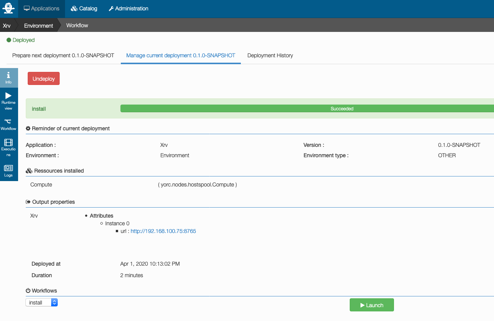

# Xrv (eXtreme Remote Visualizer) Application Template

First draft of Xrv application template, installing Xrv and paraview,
then starting Xrv on a port provided in input.

To use this Application template, you need first to add it in Alien4Cloud catalog.

First, login in Alien4Cloud as a user who ans admin role or architect role.
Once done, select Menu `Catalog` > `Manage Archives`, this page appears:

Click on `Git import`, this page appears where you can enter:
* the repostiory URL: `https://github.com/laurentganne/tosca-samples`
* the branch: `master``
* the directory to import: `visualization`.

Once entered, click on `+`, then click on `Save`.

Thos page appears, describing the new git location defined.
Click on the button to import this git location :

This will import TOSCA components and application templates from this git location.

Once done, click on the menu `Applications`. This page appears :

Click on `New Application`, a window appears when you can
* provide a `name` for the Application to create
* select to create the application from a `Topology Template`
* select the Topology Template `XrvTemplate`.

Click on `Create`, a new application is created and this page appears:

To deploy this application, click the Environment line indicated above.
A deployment wizard appears, where the first steps passed as no user input was needed.
(The application input `port` has a default value, so no there is no required input parameter here)
The current step selected is the `Locations` step :

Here, there is just one location, a Hosts Pool location.
Select this location, this is the end of the deployment wizard:

Click on `Review and Deploy`, a summary of the deployment that will occur is displayed:

Click on `Deploy`, the deployment takes place.
A page describing the deployment appears, click on `Workflow` on the left side
to follow the install workflow currently in progress:

Above, the allocation of the host in Pool is done, the workflow is currently installing packages,
and the next step will start Xrv.

Once done, you can click on `info` on the left side, this page appears:

In the outputs section, the URL where Xrv is available is provided.

